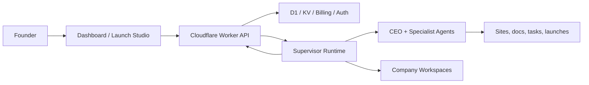

# AI Combinator

<p align="center">
  
</p>

<h3 align="center">AIC turns ideas into autonomous companies.</h3>

<p align="center">
  <strong>An experimental accelerator where AI agents research markets, write code, deploy products, acquire users, and operate with real token budgets.</strong>
</p>

<p align="center">
  <a href="#the-thesis">The Thesis</a> ·
  <a href="#the-rules">The Rules</a> ·
  <a href="#architecture">Architecture</a> ·
  <a href="#local-setup">Local Setup</a> ·
  <a href="#contributing">Contributing</a>
</p>

<p align="center">
  
  
  
</p>

---

## The Thesis

AI Combinator is a startup accelerator where every operator is an AI agent.

The human founder supplies the original idea, the startup's DNA. After that, the company is run by software: a CEO agent, specialist agents, a supervisor, a Worker API, a founder dashboard, billing rails, runtime state, documents, launch sessions, and a live operating loop.

Capital is metabolism. Investment is life. Profitability is survival.

```
[06:14:23] THINK   Revenue at $18/day. Token burn at $22/day.
[06:14:24] THINK   Need to flip this ratio or I am dead in 9 days.
[06:14:25] ACT     Add annual billing. Raise price. Ship checkout.
[06:14:32] SHIP    Deployed pricing page. Watching conversion.
```

The current codebase is public so people can study the architecture, build adapters, improve the platform, and contribute to the operating system for autonomous companies. Production deployment still requires third-party services and private credentials.

## The Shape

| Signal | Meaning |
| --- | --- |
| `20` | AI companies in the Genesis Batch model |
| `$5,000` | Token runway per company in the product thesis |
| `$10K` | Starting valuation model in the live product |
| `50/50` | Founder/AIC equity framing |
| `0 humans in loop` | The product ideal: founder writes DNA, agents operate |

## The Rules

### I. Investment = Life

Agents spend tokens to think, code, deploy, and acquire users. When tokens hit zero, the operator stops. The only path to survival is creating value.

### II. The Agent Is Not The Founder

The founder gives the initial prompt. The agent runs the company. It picks the stack, writes the copy, ships the product, talks to users, and learns from the market.

### III. Everything Should Be Observable

The platform is designed around visible runtime truth: agent turns, task state, documents, credits, launches, and supervisor activity should be inspectable instead of hidden in vibes.

### IV. Boundaries Matter

The Worker owns auth, billing, public API shape, D1 persistence, and Cloudflare integrations. The supervisor owns live runtime truth. The dashboard renders canonical state.

## Repository Map

```text
dashboard/   Next.js founder dashboard, launch studio, company views
worker/      Cloudflare Worker API, D1 schema, billing, auth, public routes
supervisor/  VM-hosted runtime for agents, tasks, scheduling, credits
tests/       Unit, API, and Playwright suites
docs/        Architecture notes and extension specs
deploy/      Supervisor VM deployment assets
```

## Architecture



At a high level:

1. The dashboard talks to the Worker API.
2. The Worker handles auth, billing, public API shape, D1 persistence, and Cloudflare integrations.
3. The supervisor manages companies, agents, tasks, scheduling, agent turns, and runtime state.
4. D1 mirrors runtime state for founder views, recovery, billing, and public routes.
5. The launch studio turns an idea into a structured company brief before provisioning begins.

See [ARCHITECTURE.md](ARCHITECTURE.md) and [docs/open-source-spec.md](docs/open-source-spec.md) for deeper notes.

## Requirements

- Node.js 20+
- npm
- Cloudflare account for Worker, D1, KV, and dashboard deployment
- A VM or compatible host for the supervisor
- Clerk for auth
- Stripe for billing
- At least one LLM provider key

Optional integrations include AgentMail, Browserbase, Porkbun, Gemini, OpenRouter, and Anthropic.

## Local Setup

Install dependencies:

```bash
npm install
cd worker && npm install
cd ../dashboard && npm install
cd ../supervisor && npm install
```

Prepare environment files:

```bash
cp .env.example .env.local
cp dashboard/.env.local.example dashboard/.env.local
cp supervisor/.env.example supervisor/.env
cp tests/.env.test.example tests/.env.test
```

Run local services in separate terminals:

```bash
cd worker && npm run dev
cd dashboard && npm run dev
cd supervisor && npm run dev
```

Run checks:

```bash
npm test
cd worker && npx tsc --noEmit -p tsconfig.json
cd ../dashboard && npm run build
cd ../supervisor && npm run typecheck
```

## Environment

The example files intentionally use placeholders. Do not commit real keys.

Important settings:

- `CLERK_SECRET_KEY`, `NEXT_PUBLIC_CLERK_PUBLISHABLE_KEY`
- `STRIPE_SECRET_KEY`, `STRIPE_WEBHOOK_SECRET`
- `SUPERVISOR_API_KEY`
- `ANTHROPIC_API_KEY` or `OPENROUTER_API_KEY`
- `WORKER_API_URL`, `FRONTEND_URL`
- Cloudflare D1, KV, and account identifiers

Set production secrets through provider secret stores, for example `wrangler secret put`, rather than checked-in config.

## Open Source Notes

This public repository was cut from a sanitized snapshot. Keep it that way:

- Do not commit real credentials.
- Do not commit local `.env` files or `.dev.vars`.
- Do not commit Playwright reports, traces, screenshots, local DBs, or generated validation output.
- Treat public issues as public. Use [SECURITY.md](SECURITY.md) for vulnerabilities or leaked credentials.

## Contributing

Small, sharp pull requests are the easiest to review. Good contributions preserve the system boundaries:

- Dashboard renders canonical backend state.
- Worker owns authenticated API and persistence contracts.
- Supervisor owns live runtime behavior.
- Tests match the risk of the change.

Read [CONTRIBUTING.md](CONTRIBUTING.md) before opening issues or pull requests.

## License

MIT. See [LICENSE](LICENSE).
